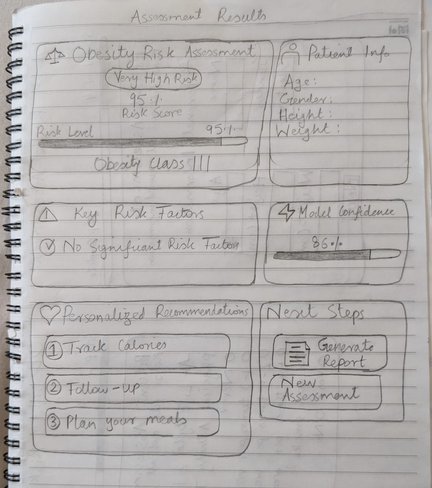
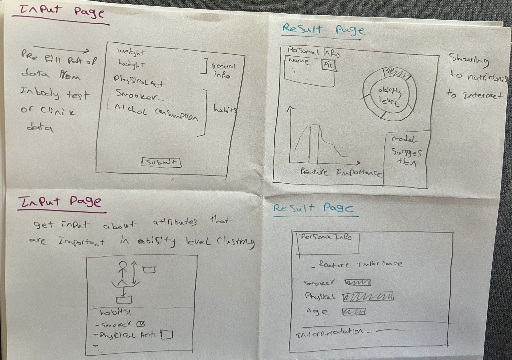
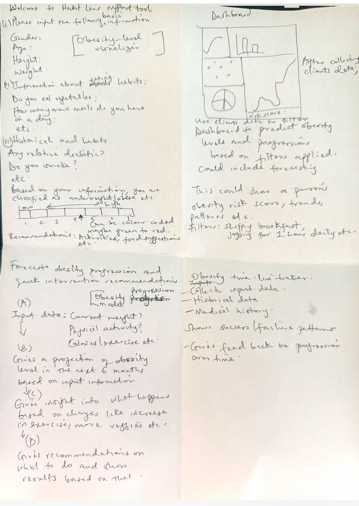
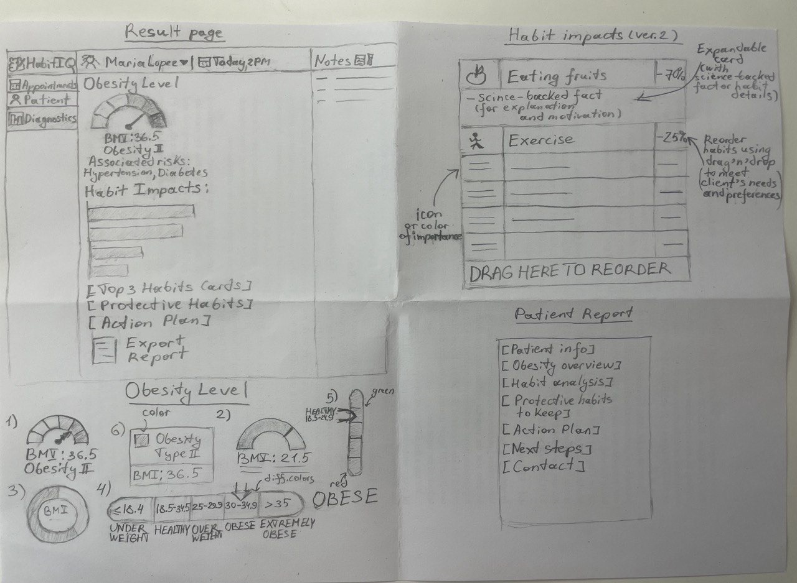
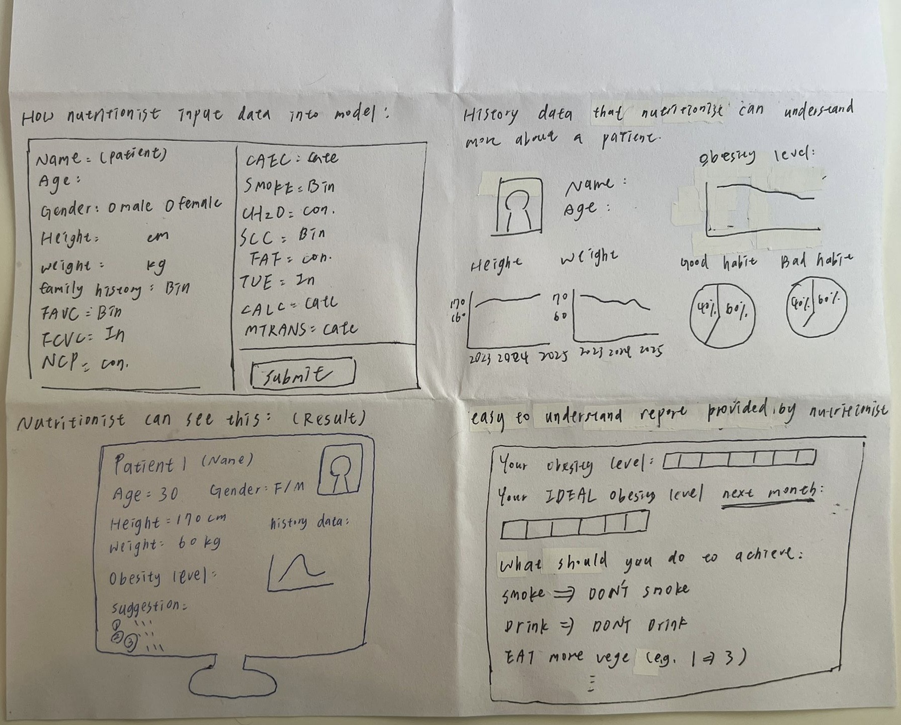
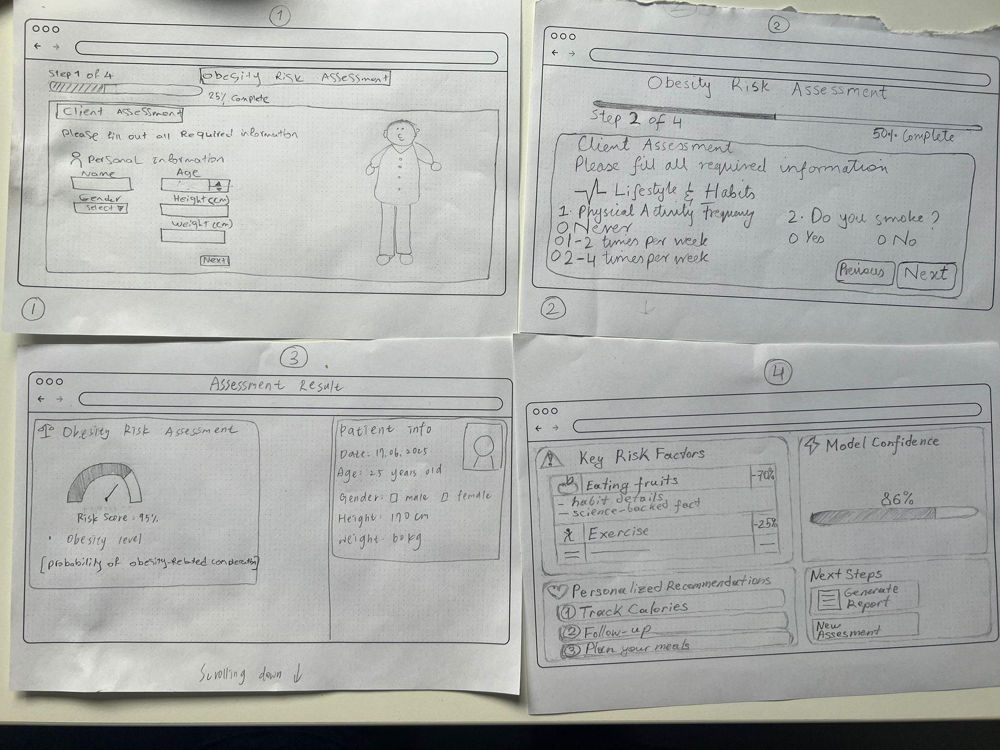

# Project Title
Ethical Exploration of the Dataset for Estimation of Obesity Levels.

> Scroll to the end for instructions on how to run the application.

## 1. Dataset Description
**Dataset Name:** Estimation of Obesity Levels Based On Eating Habits and Physical Condition

**Source / Link:** https://archive.ics.uci.edu/dataset/544/estimation+of+obesity+levels+based+on+eating+habits+and+physical+condition

**Domain / Context:** Health and Medicine (specifically related to obesity estimation based on lifestyle factors)

**Number of Instances:** 2111

**Number of Features:** 17 (including the target variable)

**Possible Target Variable(s):** NObesity (Obesity Level), which categorizes individuals into: Insufficient Weight, Normal Weight, Overweight Level I, Overweight Level II,Obesity Type I, Obesity Type II, Obesity Type III

**Data Access & License:** The dataset is publicly available and can be accessed via the UCI repository. It is licensed under CC BY license.

### Other Information:
**Countries Represented:** Mexico, Peru, and Colombia

**Article:** https://www.sciencedirect.com/science/article/pii/S2352340919306985?via%3Dihub

**Who created the dataset?** The dataset was created by a team of researchers (Fabio Mendoza Palechor, Alexis de la Hoz Manotas)

**When was the dataset created?** The dataset was donated on 8/26/2019.

**What does each attribute mean?** 
- Gender
- Age
- Height
- Weight
- family_history_with_overweight (Has a family member suffered or suffers from overweight?)
- FAVC (Do you eat high caloric food frequently?)
- FCVC (Do you usually eat vegetables in your meals?)
- NCP (How many main meals do you have daily?)
- CAEC (Do you eat any food between meals?)
- SMOKE (Do you smoke?)
- CH2O (How much water do you drink daily?)
- SCC (Do you monitor the calories you eat daily?)
- FAF (How often do you have physical activity?)
- TUE (How much time do you use technological devices such as cell phone, videogames, television, computer and others?)
- CALC (How often do you drink alcohol?)
- MTRANS (Which transportation do you usually use?)
- NObeyesdad (Obesity level)

**For what purpose was the dataset created?** The dataset was created to estimate obesity levels in individuals based on their eating habits and physical condition. It is suitable for tasks such as classification, regression, and clustering.

**Are there missing values?** No

**Does the dataset contain metadata, e.g., a README file?** The UCI repository entry provides a brief overview of the dataset but does not include a comprehensive README file or detailed metadata.

**Short Description:** This dataset contains information on obesity levels based on eating habits and physical conditions, collected from individuals in Mexico, Peru, and Colombia. It includes 2111 instances and 17 features, with the target variable NObesity categorizing individuals into seven obesity levels. The dataset can be used for classification, regression, and clustering tasks and is publicly available under a CC BY license.

## 2. Decision-Making Scenario
**Scenario: The "HabitIQ" Clinical Support Tool**  
A dietitian is in his clinic for an initial consultation with a new client who wants to achieve a healthier weight. During the interview, the dietitian inputs the client's physical attributes and habits details — such as meal frequency, physical activity, and screen time — into a diagnostic software called "HabitIQ".

**Decision to be made:**  
The dietitian needs to decide which specific habits changes to prioritize in the client's initial wellness plan for the most effective results.

**How the ML model supports the decision:**  
The system uses a ML model that has learned to  make a prediction based on a client's habits and physical attributes, do they fall into the "Obesity" or "No-Obesity" group. More importantly, the model then explains why it made that choice. It calculates the impact of each individual habit, showing the dietitian exactly which habits are most responsible for pushing a client into the 'Obesity' category. This provides the dietitian with a clear, data-backed list of the most impactful habits changes to focus on first.

**Context / Use Case:**  
The dietitian uses this information on his desktop computer during the one-on-one consultation with a client. Instead of relying solely on his expertise and intuition, he can use the model's output to immediately focus on the most impactful, evidence-backed changes, allowing him to co-create a highly personalized and effective action plan with his client.

**Type of ML Task:** Classification

**Constraints & Requirements:** 
- **Interpretability:** The model must be explainable for nutritionists and end-users to trust and act on.

- **Legal Constraints:** User data must be stored and processed in compliance with GDPR and medical data protection regulations.

- **Data Quality:** 77% of the data is synthetic which may affect real-world generalizability. 

- **Technical Constraints:** All features must be provided by the user to obtain a prediction (no missing values are allowed).

- **Functional Constraints:** The model must provide near real-time recommendations.

- **Ethical Constraints:** Recommendations must not risk user health (e.g., unsafe dietary or exercise advice).

- **Domain Knowledge Gap:** ML experts may lack nutrition-specific understanding. Collaboration with healthcare professionals may be required.

**What is at stake in this decision?**
- **User Health & Safety:** Poor recommendations can lead to unhealthy behaviors like under-eating or over-exercising.

- **Trust in the System:** Users and professionals may reject the tool or refuse to trust its recommendations if it lacks transparency or accuracy.

- **Reputation & Liability:** Incorrect or harmful advice could create legal risks and loss of credibility for both the provider and the operator.

- **Model Fairness:** The model needs to be fair, because there is a risk of biased predictions affecting specific groups based on factors like their gender or age.

- **Adoption & Usability:** If the model isn’t interpretable or practical, it won’t be used effectively by nutritionists or users.

## 3. Stakeholder Analysis
### Stakeholder list:
- Patient, user 
- Nutritionist or Trainer
- ML expert

#### Stakeholder Patient, User:
##### Stakeholder Knowledge:
- Limited technical knowledge.
- Basic understanding of health and nutrition.
- Personal insight into their own habits and lifestyle.

##### Goals:
- To achieve a normal weight
- To become fit and healthy

##### Objectives:
- Be informed about their own current status.
- Be self-aware of the factors that affect obesity the most.
- Achieve a specific weight based on your demographics.
- Achieve nutrition goals based on recommendations, like eating more vegetables.
- Receive personalized recommendations on current habits to change in order to reach a normal weight.

##### Tasks:
- Prepare Complete information to the Nutritionist or Trainer.
- Follow the directions of the Nutritionist or Trainer.
-Attend follow-up sessions and track progress.

##### Key Questions:
- Is my data safe and private?
- Can I trust this system's recommendations?

#### Stakeholder Nutritionist or Trainer:
##### Stakeholder Knowledge:
- Deep understanding of physical health and dietary science.
Goals:
- Easily use the model and give Smart suggestions.
- Understand the model well enough to interpret results confidently.

##### Objectives:
- Understand how the results are structured and be able to find flaws/errors of the model.
- Be aware of the model’s feature importance.
- Mix his own domain knowledge with the model recommendations and give a proper suggestion.
- Customize the model to the patients personal characteristics.

##### Tasks:
- Gather patients’ or users’ inputs and input them to the system.
- Combine his knowledge with the model and give proper suggestions.
- Personalize recommendations by his knowledge and model output.

##### Key Questions:
- How reliable is this recommendation?
- What features most influenced this suggestion?
- Can I override the system’s advice if I disagree?

#### Stakeholder ML expert:
##### Stakeholder Knowledge:
- Strong technical understanding of ML/AI, algorithms, and model evaluation.
- Has limited domain knowledge in nutrition or physical fitness.

##### Goals:
- Create a robust, fair, and interpretable model
- Ensure the system has real-world impact and commercial value.

##### Objectives:
- Make an accurate model that can be well interpreted.
- Build a UI/UX friendly Model for non technical people.
- Make and sell the product.
- Gather feedback about performance of model in action.

##### Tasks:
- Train and Test the Model.
- Make a proper explanation and presentation for users.
- UI and UX design.
- Fine-tune the model based on feedback and design a mechanism for it.

##### Key Questions:
- Is the model biased toward certain groups?
- Which features most influence predictions?
- How should I communicate uncertainties to users?

## Realistic decision-making scenario 
- What real-world decision could be made with this dataset?
- What kind of recommendations we should provide to a person to help them achieve a normal weight?

## 4. Prototyping
### Stakeholder: Nutritionist or Trainer

**What prior knowledge does the Stakeholder need to use your application?**
- Nutrition/Fitness expertise: Understanding of obesity risk factors, behavior change strategies, nutrition basics (for Nutritionists), and exercise science (for Trainers).
- Digital tool familiarity: Ability to use diagnostic software and interpret results.
- Client communication skills: Effectively explaining findings and collaboratively create action plans with clients.

**What explanations might the Stakeholder need?**
- Prioritized list of obesity factors (with percentages of impact)
- Comparative effectiveness (e.g., "Reducing high caloric food is more impactful than increasing exercise").
- Model confidence score

**What prior knowledge in Data Science needed to understand the decision?**
None. Explanations use practical, non-technical language.

### Individual Paper Prototypes











### Group Paper Prototype


## Other Important Notes
**What are possible constraints & requirements?**
1. If our recommendation system provides recommendations that can cause harm for person's health (eg. advicess to start smoking to achieve a normal weight)
2. Store securely user's data in accordance to GDPR
3. A value is required for all of the features to make a prediction
4. Our recommendation system should provide a prediction in a reasonable amount of time

**What are the stakes?**

High stakes, because we can provide recommendations that can cause harm to person's health because:
1. predict wrong predictions (because of model's errors).
2. recommendations are not tailored to a user.
3. autors of software and end users don't know the domain.
4. users could overact on recommendations (eg. don't eat at all, overexercising)

**What ML model might be used?**

We can use tree-based models, because they're easily explainable as the trees could be plotted.

## Scenario Brief:
We could create a software that would provide recommendations for a user that would help them to achieve a normal weight. This software could be used by a nutritionist.

### Scenario Walkthrough with Paper Prototype



## Model Training & Explanations

You can find Model training and explanations details here: https://colab.research.google.com/drive/1bQiXDFy0IIsvTnZQEUF4fzrHaY12SRpH?usp=sharing

## User Guide
**1. Decide which user needs are interesting and note which questions you might need to ask. Write down questions you are interested in.**  
**User needs:**
- simple and intuitive interface
- not spend much time to achieve their goal with the application
- don't need prior training
- interact with pleasing UI
- effectively achieve their goals with the app
- ability to fullfill client needs

**Questions:**. 
- Does the results page feels intuitive for you?  
- How do you like the process of filling client information? 
- How do you feel regarding performance of the app? Does it feel fast enough?  
- Did you feel lost during the process of using the app?  
- Does the user need to have domain knowledge to use the app? 
 
**2.  Normally, a consent form is needed. In this case, at least ask for consent to use the answers for your presentation and evaluation.** 
- Do you agree that we use your answers for the improvement of our model?

**3. Introduce the general idea of your scenario and the decision-making setting, and who the primary Stakeholder is, such that the person understands the context. But don’t explain more, than the average user would know!**

**4. Start with easy open questions in a semi-structured way, e.g., “Do you use many apps?”, “Have you ever used a tool like this?”, “Who do you think would need such a product?”.**
- Do you use many apps?
- What kind of apps do you use (health, sport, habits, games)?
- Who do you think would need such a product?
- Does the user need to have domain knowledge to use the app?
- What is your favourite app type?
- What apps do you use daily?
- Do you like to fill forms?

**5. Let the interviewee experience your prototype and not implemented ideas (simulate functionality if needed): Ask the interviewee to think-aloud, while you passively guide through the prototype.**

**5.1 Think about things users would like to do with the tool and formulate them as tasks (at least five). To get more information, ask open questions after the interviewee finishes thoughts in a specific context such as: “What would you do next?”. Here you have the goal, to understand current problems, expectations and needs of the users.**
- Fill the form with the client data
- Interpret the results
- Edit wrong inputs in the form
- Summarize the results to the client
- Go to Personalized Recommendations section, add one more recommendation and delete one.
- Generate a report for the client

**5.2 Ask open-ended feedback questions (at least five) regarding topics like preferences, problems, wishes & so on.**
- How did you like the app?
- What would you change in the app?
- What did you find the most challenging in the app?
- What part was the most favourite?
- What extra features would you like to see?
- How easy was it to understand the results page?
- How insightful was the results page?
- How do you find the app design?
- How do you find the user flow?

**6. Finish & Goodbyes!**

## User Study Feedback

### Participant 1:

**Overall impression:** "It was fine."

**Clarity Issues:**
- Needed clearer definitions/explanations:

  - What qualifies as "physical activity."
  - What is considered "high-calorie food" (suggested adding examples or general categories).

- Found it difficult to estimate vegetable and water consumption (suggested providing guidance or measurement help).

**Results Page:**
- Difficulty identifying the most important information.
- Risk Factors and Recommendations sections use the same color (suggested using a more warning color for Risk Factors).

**UI/UX Concerns:**
- The red color for selected checkboxes felt like an error indicator (it implies the user did something wrong).
- Did not understand that the gauge represents the "Future Obesity Score" based on entered habits, leading to surprise at the results.
- Input fields were perceived as unnecessarily large.
- Increasing/decreasing numbers using the arrows was slow due to distance (suggested making elements smaller and closer together to reduce mouse movement).


### Participant 2:
**Overall impression:** "It was great!"

**Positive Feedback:**
- Praised the visuals and "super simple" interface.
- Found the interface easy to understand; good separation of information, icons, and titles.

**Suggestions for Improvement:**
- Clarity:
  - Did not understand that the gauge represents the "Future Obesity Score" based on habits.
  - Suggested clarifying the timeframe implied by "Future" (e.g., 6 months, 1 year, 10 years).

- UI/UX:
  - Wants to add "Diverse" as a gender option.
  - Suggested changing the gauge's color scheme (noted duplicate yellow at start; proposed using gray or blue instead).
  - Suggested color-coding the BMI result to indicate if it's "good" or "bad".
  - Identified a "Nice to have" feature: Ability to go back and correct specific data after seeing results, instead of restarting the entire process.

### Key Feedback Highlights
1. **Clarity of Terms:**
- Unclear definitions: "physical activity," "high-calorie food," "Future Obesity Score," "Future" timeframe.
- Difficulty estimating vegetable/water intake without guidance.
2. **Results Page Issues:**
- Gauge: Purpose misunderstood (future score based on habits), color scheme confusing (double yellow).
- Important information not prioritized.
- Identical colors for "Risk Factors" (should signal warning) and "Recommendations."
3. **UI/UX Frustrations:**
- Checkboxes: Red selection color perceived as error/wrongdoing.
- Inputs: Fields too large; arrow buttons inconveniently placed.
- BMI: Lacks visual health indicator (good/bad).
4. **Inclusivity:**
- Missing "Diverse" gender option.
5. **Flow:**
- No way to edit data after submission (full restart required).

### Design Implications
1. Ambiguous labels/terms reduce trust & accuracy → Need explanations and examples.
2. Predictive metrics need explicit context → Scores must clarify data source ("based on habits") and timeframe.
3. Visual hierarchy fails to communicate importance → Risk factors require stronger visual signaling.
4. Color semantics conflict with user expectations → Red = error; avoid repurposing for positive actions.
5. Input efficiency impacts usability → Compact, ergonomic controls reduce inconvenience.
6. Missing inclusivity options alienate some users → Gender selections must reflect diversity.
7. Rigid user flows create frustration → Allow partial data correction after submission.

### Proposed Changes
1. **Clarity & Explanations**
- Add tooltips/examples:
  - "Physical activity": "e.g., gym workouts, fast walking, cycling, swimming ≥10 min"
  - "High-calorie foods": "e.g., fast food, sugary drinks, fried snacks"
  - Vegetable/water inputs: Add helper text ("1 serving ≈ 1 cup raw veggies"; "1 glass ≈ 250ml").
- Relabel the gauge:
  - E.g. "Estimated 5-Year Obesity Risk Score"
  - Subtitle: "Based on your current lifestyle habits".

2. **Visual Design & Hierarchy**
- Results page:
  - Risk Factors: Use yellow/orange color
  - BMI: Add color-coded label (Green: "Healthy", Yellow: "Overweight", Red: "Obese").
- Checkboxes: Change selection color to blue or green (positive action).
- Gauge: Remove duplicate colors. Colors: Gray (low) → Green → Yellow → Red (high score).

3. **Input Optimization**
- Reduce input field sizes by 20-30%.
- Add a "?" icon next to complex inputs (e.g., vegetable intake) linking to a visual guide.

4. **Inclusivity:**
Add "Diverse" to gender options.

5. **Flow:**
[Optional] Post-submission edit: Add an "Edit Responses" button on results page → Opens sectionized form with pre-filled prior answers.

### Prioritization
**Change** | **Priority** | **Effort** | **Remarks**
| -------- | ------- | ------- | ------- |
Clarify "Future Obesity Score" | Critical | Low
Fix checkbox/risk factor colors | High | Low | Done
Add input examples/guides | High | Medium | Done
BMI color-coding | Medium | Low
Gender option addition | Medium | Low | Not possible - dataset only includes Male and Female
Compact input fields | Medium| Medium | Done
Enable data editing post-submit | Medium | High


## How to Run the HabitIQ Application

### Prerequisites
- [Anaconda](https://www.anaconda.com/products/distribution) or [Miniconda](https://docs.conda.io/en/latest/miniconda.html) installed on your system
- Git (optional, for cloning the repository)

### Quick Start

1. **Clone or download the project:**
   ```bash
   git clone https://github.com/AyaanDanish/HabitIQ-for-Obesity-Levels.git
   cd HabitIQ-for-Obesity-Levels
   ```
   *Or download and extract the ZIP file*

2. **Create the conda environment:**
   ```bash
   conda env create -f environment.yml
   ```

3. **Activate the environment:**
   ```bash
   conda activate habitiq
   ```

4. **Run the application:**
   ```bash
   streamlit run source/app.py
   ```

5. **Open your browser:**
   The application will automatically open at `http://localhost:8501` or you'll see the URL in your terminal.

### Alternative Setup (if conda fails)
If you encounter issues with conda, you can use pip:
```bash
# Create a virtual environment
python -m venv habitiq_env

# Activate it
# On Windows:
habitiq_env\Scripts\activate
# On macOS/Linux:
source habitiq_env/bin/activate

# Install dependencies
pip install -r requirements.txt

# Run the application
streamlit run source/app.py
```

### Troubleshooting
- **Environment already exists:** `conda env remove -n habitiq` then recreate
- **Permission errors:** Run as Administrator (Windows) or use `sudo` (macOS/Linux)
- **Model file not found:** Ensure you're running from the project root directory
- **Port already in use:** Add `--server.port 8502` to the streamlit command

For detailed setup instructions and troubleshooting, see [CONDA_SETUP.md](CONDA_SETUP.md).


## Authors
- Syed Ayaan Danish
- Abisola Ajuwon
- Niloufar Neshat 
- Tanya Ignatenko 
- Yi-Hui Fan
